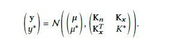
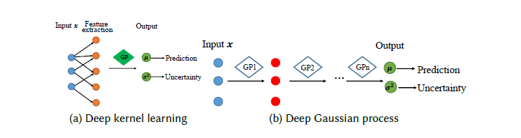

# A Survey on Uncertainty Quantification Methods for Deep Learning
Chrysoula, August 2025

---

# Model uncertainty

- Comes from the lack of evidence or knowledge during model training or inference, e.g., limited training samples, sub-optinal DNN model architectures or parameter algorithms and out-of-distribution samples (ODD).
- It is reducible given more data.

---

# Types of model uncertainty

- Choice of model hyper-parameters (e.g., choice of model families, number of neural network layers, hidden layer dimension).
- Uncertainty in model parameter learning (e.g., the choice of optimizers).
- Uncertainty due to different sample distributions in learning and inference (e.g., out-of-distribution samples (OOD)).

---

# Categories of model uncertainty

- Bayesian Neural Networks 
   - Variational Inference (VI)
   - Laplace approximation
   - Markov Chain Monte Carlo approximation (MCMC)
   - Monte-Carlo (MC) dropout
-  Ensemble methods
-  Sample distribution-related methods
  
---

# Bayesian Neural Networks
### Variational Inference (VI)
- We find a variational approximation to the Bayesian posterior distribution on the weights by maximizing the evidence lower bound (ELBO) of the log marginal likelihood:
 
$$
\log p(Y \mid X) 
\geq \mathbb{E}_{\theta \sim q_\phi(\theta)} \left[ \log \frac{p(Y \mid X, \theta) p(\theta)}{q_\phi(\theta)} \right] = 
$$

$$
\mathbb{E}_{\theta \sim q_\phi(\theta)} \left[ \log p(Y \mid X, \theta) \right] - \mathrm{KL}(q_\phi(\theta) \\|\ p(\theta))
$$

- The posterior $ p(\theta \mid X, Y)$ is approximated with a parametric distribution $ q_\phi(\theta)$.
- The first term is the log- likelihood of the training data on the neural network model, while the second is the Kullback-Leiber (KL) divergence between the posterior estimation and the prior of the model parameters, which controls the complexity.

--

## Challenges of VI: Choosing the distribution class $ q_\phi(\theta)$
- Mean-Field Variational Inference:
  - Uses a Gaussian distribution with diagonal covariance.
  - Offers a simple lower bound for optimization.
  - Limitation: poor at capturing posterior correlations between parameters.
- Full Covariance Gaussian Approaches:
  -  Extend diagonal covariance to general covariance matrices.
  -  Better at capturing parameter correlations.
  -  It is tractable via ELBO maximization.
  -  Disadvantage: it increases the number of tractable parameters, the memory and the computational cost.
- Covariance matrix structure with ceratin assumptions:
  - Block-Diagonal Covariance: 
    - Assumes independence among layers.
    - Leads to block-diagonal structure.
  
--
  - Low-Rank Structure:
    - A variety of deep BNNs using Gaussian VI often show low-rank posterior structure.
    - Solution: Low-rank factorization of dense covariance matrix.
  - Diagonal plus low-rank:
    - Combines diagonal and low-rank components for flexibility and speed.
  - Sparse and Hierarchical Posterior Approaches:
    - Use hierarchical posteriors or normalizing flows with low-dimensional auxiliary variables.
    - Goal: Reduce computation.
  
--
## Disadvantage of variational Gaussian approximation

- Capturing full correlations among latent weights requires a full covariance matrix.
- Number of variational parameters scales quadratically with the number of latent weights.

---
# Bayesian Neural Networks
## Laplace approximation
- It approximates the posterior around the MAP estimator of neural network weights with a Gaussian distribution based on the Hessian of the log-likelihood.
- It can be applied post-hoc to a pre-trained neural network model.
- The posterior approximation is:
$$p(\theta \mid X, Y) \approx \mathcal{N}(\hat{\theta}, H^{-1})$$
where $\hat \theta$ is the MAP estimate and $H$ is the Hessian matrix.
- It approximates the posterior locally and simplifies the computation of the posterior.
  
--

## Disadvantages of Laplace approximation
- It is a local approximation around the MAP mode.
- Cannot model multi-modal posteriors.
- The Hessian inversion is computationally expensive for millions of parameters.

--
## Hessian Approximation Techniques
- Ignore covariance between weights and extract the diagonal of the Hessian matrix.
- Kronecker factored approximations:
  - Factorizes Hessian into Kronecker product of smaller matrices.
  - Scales to deep convolutional networks.
  - Enables Bayesian online learning.
  - Assumes layer independence, which may lead to an overestimation of the variance.
  
--
## Calibration of the predictive uncertainty
- Tuning Prior Precision:
   - Adjusts Gaussian prior precision to regularize the approximation.
   - Helps avoid placing probability mass in low-probability regions.
   - Requires validation-based optimization, which may not generalize well.
- Uncertainty-Aware Training with Hidden Units:
  - Adds extra hidden units to MLP-trained networks.
  - Trains with an uncertainty-aware objective.
  - Improves uncertainty calibration.
  - It is only applicable to MLPs, not generalizable to CNNs.
  
--
## Comparison of Laplace approximation with Variational Inference.
- Laplace approximation:
   - It is local around MAP.
   - It is post hoc (after training).
   - No impact on prediction performance.
- Variational Inference:
   - It is global (entire posterior).
   - It is used during training.
   - It has an impact on prediction performance.
  
---
# Bayesian Neural Networks:
## Markov Chain Monte Carlo (MCMC) approximation 
- It samples from an intractable distribution.
- The goal is to approximate the posterior $p(\theta|X,Y)$ for Bayesian inference.
- It constructs an ergodic Markov chain whose stationary distribution is the posterior and draws samples $\theta_i \sim p(\theta|X,Y)$ from the chain.
- The inference step of BNNs is approximated by:
$$
p(y^* \mid x^*, X, Y) = \int p(y^* \mid \mathbf{x}^*, \boldsymbol{\theta}) \ p(\boldsymbol{\theta} \mid X, Y) \ d\boldsymbol{\theta} 
\approx \frac{1}{N} \sum_{i=1}^{N} p(y^* \mid x^*, \boldsymbol{\theta}_i)
$$

--
# Bayesian Neural Networks:
## How the MCMC works:
- Each sample depends only on the previous sample.
- It uses a proposal distribution $T(\theta'|\theta)$ to suggest new states.
- The proposal samples are stochastically accepted with acceptance probability:
$$
\alpha(\theta', \theta) = \frac{T(\theta' \mid \theta)  p(\theta' \mid x)}{T(\theta \mid \theta') p(\theta \mid x)}
$$
- The new sample is accepted if a random variable $\mu \sim Unif(0,1)$ is less than $\alpha$, otherwise retains the previous sample.

--
# Bayesian Neural Networks:
## Challenges of MCMC:
- Random walk behavior from isotropic Gaussian proposals slows exploration.
- High rejection rate and slow convergence.
- Issues due to high-dimensional parameter spaces in modern DNNs.
## Recent Improvements:
- Focus on efficient sampling and faster convergence.
- Hybrid methods combine MCMC with variational inference (VI)
   - VI is faster but may poorly approximate the true posterior.
   - MCMC can approximate the exact posterior with a sufficient number of iterations.
- Markov Chain Variational Inference (MCVI):
   - It interprets the Markov chain as a variational approximation over an expanded space.
   - It uses an auxiliary variational distribution $
r(\theta_0, \dots, \theta_{T-1})
$.
- The samples can be obtained by optimizing the lower bound over the parameters with a neural network.

--
# Advantages and disadvantages of MCMC:
### Advantages:

- Samples converge to the exact posterior with enough iterations.
- Trade-off control: Balance between accuracy and computational cost. 

### Disadvantages:
- Unknown number of iterations for convergence. 
- Computationally expensive and time-consuming. 

---

# Bayesian Neural Networks
## Monte Carlo (MC) Dropout
- It is a popular method for uncertainty quantification in DNNs.
- The optimization of a neural network with a dropout layer can be interpreted as variational inference on a Bernoulli distribution over weights. 
## Concept:
- Dropout randomly deactivates neurons during forward passes.
- Multiple stochastic forward passes with different dropout masks.
- Variance of predictions across passes estimates model uncertainty.
- It approximates integration over model weights using Bernoulli variational distribution.

--
## Advantages and Disadvantages of MC dropout
### Advantages:
- Minimal modification to the architecture design
- It is easy to implement in existing DNNs.
- It affects only inference, not training.
- It preserves model accuracy.
### Disadvantages 
- It is less calibrated than other uncertainty quantification methods.
- Approximation may lead to less accurate uncertainty estimates.
- It is still a computationally intensive method.

---
# Ensemble methods
- Combine multiple neural networks to form an output distribution.
- Model uncertainty is quantified by the variability in predictions.
- Capture uncertainty from various sources using different ensemble strategies.

--
## Strategies
## First strategy: Bootstrapping
- Random sampling from original dataset with replacement.
- Train each model on a different bootstrapped sample.
- Aggregate predictions for inference:
   - For regression: prediction variance is used.
   - For classification: average entropy is used.
## Second strategy: Different neural network architectures
- The number of layers, hidden neurons and activation functions is varying.
- Accounts for uncertainty from model misspecification.
  
--

## Third strategy: Initialization and Data Shuffling
- It uses different parameter initializations.
- It applies random shuffling of datasets.
- It utilizes more data per model than bootstrapping.

## Fourth strategy: Hyperensemble Approach
- It constructs ensembles with different hyperparameters such as learning rate, optimizer, training strategy.
  
--
## Limitations of Ensemble Models
- High computational cost since it  requires training and storing multiple networks.
- Memory maintance during inference.
- Requires model diversity for accurate uncertainty estimation.

---
# Sample distribution-related methods
- Model uncertainty is related to sample distribution. This includes OOD samples and
test samples that are far or sparse surrounded by training samples. 
- Existing methods: 
    - Gaussian process hybrid neural network.
    - Distance-aware neural network.
---
#  Sample distribution-related methods
## Gaussian Process (GP) Hybrid Neural Network 
- A GP defines a prior over functions using training data.
- It assumes that the outputs $p(y_1,...,y_n)$ follow a multivariate Gaussian distribution:
  $$ p(y_1,...,y_n)\sim N(\mu(x),\Sigma(x))$$
  where $\mu(x)$ is the mean function and the covariance matrix $ \Sigma_{ij}=k(x_i,x_j)$ uses a kernel function (e.g. radial basis function)
  to measure the similarity between pairs of input samples.

--
# GP Inference
- Given a new sample $x^*$ the joint distribution of training outputs 
  $y$ and test output $y^*$ is:

  

  <ul>   
    <li>$K_n$: Covariance among training samples</li>
    <li>$K_x$: Covariance between test sample and training samples</li>
    <li>$K^*$: Prior variance of test sample</li>
    <li>$\mu,\mu^*$: Mean predictions for training and test samples
    <li>Posterior prediction for $y^*$: $$p(y^*|x^*,D_{train},\theta)=N(y|K_x^TK_n^{-1}y,K_{x^*}-K_x^TK_n^{-1}K_x)$$
  </ul>

--
# GP Inference
- GP methods capture uncertainty related to sample sparsity, eventhough they belong to Bayesian methods.
- Lower uncertainty: When test sample is in a dense region of training data.
- High uncertainty: When test sample is in a sparse region.

---
# Sample distribution-related methods
## Sparse Gaussian process
- GP is computationally expensive for large datasets. Inverting a covariance matrix of
size $n \times n$, where n is the total number of training samples requires $O(n^3)$ time complexity. 
- A sparse approximation to the full GP reduces the computation to $O(m^2  n)$, where m is 
the number of inducing variables.
- Inducing variables are input-output pairs $(\hat{x}_i , \hat{y}_i )$ for $ i=1,...,m$
that can be anywhere in the input space and are not constrained to be part of the training data.
 - Using inducing variables allows replacing the inversion of the original covariance matrix $K_n$ with
a low-rank approximation, which only requires inverting an $m\times m$ matrix $K_m$.

--
## Sparse Gaussian process: How to choose Inducing Variables
- The goal is to select inducing variables that best represent the training data.
- A common approach is to choose inducing variables that maximize the likelihood of the training data.
- The locations of the inducing variables and the hyperparameters of the Gaussian Process are optimized by maximizing the likelihood.
- The training data likelihood is obtained by marginalizing over the inducing variables
in the joint distribution of the training data and inducing variables.

--
## Limitations of Gaussian Processes
- GPs assume that all target variables follow a joint Gaussian distribution and this 
limits their ability to capture diverse relationships in large datasets.
- GP relies heavily on kernel functions to measure similarity between samples by
transforming input features into high-dimensional space.
- Challenge to construct appropriate kernel functions to extract hierarchical features
for high dimensional structured data.
- To adress these limitations:
   - Deep Kernel Learning 
   - Deep (Compositional) Gaussian Process
  
--
##  Sparse Gaussian process: Deep kernel learning
- Deep kernel learning combines the capability of deep neural networks (DNNs)
  with Gaussian Processes (GPs) to learn flexible representations.
- DNNs can learn meaningful representations from high-dimensional data, 
which helps overcome the fixed kernel limitations of traditional GPs.
- Kernel transformation: the standard GP kernel: $K_\theta(x_i,x_j)$ is transformed 
to $K_\theta (g(x_i;w),g(x_j;w))$, where:
  - $g(\cdot;w)$ is the neural network parameterized with w.
  - $K_\theta$ is the base kernel function (e.g., radial basis function)
of GP.
- The DNN transformation can capture non-linear and hierarchical structure in
high-dimensional data.
- The GP with the base kernel is applied to the final layer of the DNN,
making predictions based on the learned latent features.

--
## Sparse Gaussian process: Deep (Compositional) Gaussian Process
-  It focuses on function composition, inspired by the architecture of DNN.
-  It is a model in which each layer is a Gaussian Process and the output of 
one GP is the input to the next layer.
- The recursive composition of GPs yields a more complex distribution over the 
predicted target variables.
- The forward propagation and joint probability distribution of the model are respectively:
$$ y=f_L(f_{L-1}(\dots f_1(x))) $$ and $$ p(y,f_L,\dots f_1|x)\sim p(y|f_L)\prod_{i=2}^{L}
p(f_i|f_{i-1})p(f_1|x)$$
where each function $f(\cdot)$ represents a GP, the intermediate distributions
follow Gaussian distributions and the final distribution captures a more complex 
distribution.

--
## Sparse Gaussian process: Deep (Compositional) Gaussian Process
- Challenge: the computation of the data likelihood $p(y|x)$, because 
it's not possible to analytically marginalize the hidden layers $f_i$.
- Solution to the challenge: variational inference, which introduces inducing points
on each hidden layer and optimizes the variational distribution $q(f_i)$.
- The marginal likelihood lower bound is computed by propagating 
the variational approximation through each layer of the model.
- This framework supports the integration of incomplete or uncertain observations 
by placing a prior distribution over the input variables 𝑥.

--
## Illustration of deep kernel learning and deep (compositional) Gaussian process

  

---
# Distance-aware neural network
- It is inspired by Gaussian Processes and quantifies the distance between samples in the input space with a metric $||\cdot||_X$.
- The goal is to learn a hidden representation $h(x)$ that preserves meaningful distances between samples.
- Issue: feature collapse, which means DNN can map both in-distribution and out-of-distribution samples to similar latent features. This causes the model
to be overconfident on unfamiliar inputs.
--

# Distance-aware neural network
- To prevent feature collapse: sensitivity, smoothness and bi-Lipschitz constraints are applied.
   - Sensitivity: small changes in input should result in small changes in feature representation. 
   - Smoothness: small changes in input should not cause dramatic changes in the output.
   - bi-Lipschitz: ensures both sensitivity and smoothness by bounding feature changes: $$ L_1 * \|x - x'\|_X < \|h_\theta(x) - h_\theta(x')\|_H < L_2 * \|x - x'\|_X $$
   
--
# Distance-aware neural network
##  Approaches to enforce bi-Lipschitz constraints
- Spectral Normalization:
   - Normalizes weight matrices using their spectral norm.
   - Ensures Lipschitz constant is $L<1$.
   - Fast and effective for practical implementation.

- Gradient penalty: 
   - Introduces a loss penalty: the squared gradient at each input sample $\nabla_x^2 h_\theta(x)$.
   - Adds a soft constraint to control the Lipschitz coefficients.
   - More computationally intensive than spectral normalization.

---
# References 
- [1] W. He, Z. Jiang, T. Xiao, Z. Xu, and Y. Li, “A survey on uncertainty quantification methods for deep learning,” *arXiv preprint arXiv:2302.13425*, 2023. DOI: https://doi.org/10.48550/arXiv.2302.13425

---

#  Thank you!

